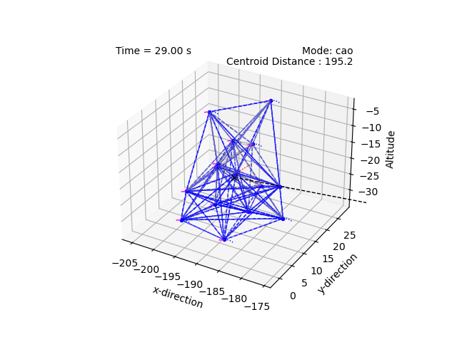
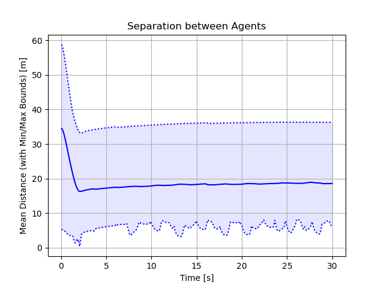
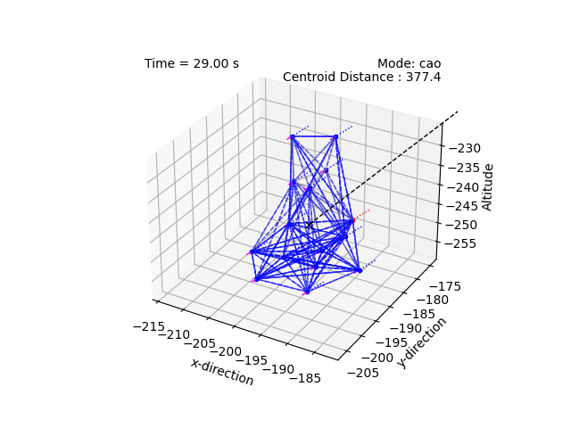
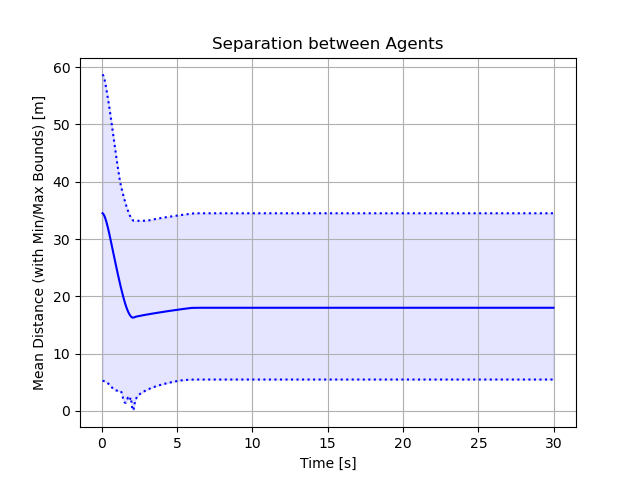

# Flocking Control Against Malicious Agents

This project investigates swarming with malicious agents that 
intentionally falsify their control parameters in order to cause 
collisions, divide, or escape from the swarm. This is an implemenation 
of the work proposed in Ref. 1, with added features for auto-assembly from 
random initial conditions via pinning control.

# Methodology

The technique uses a hierarchical geometric configuration-based methodology, 
where agents immediately neighbouring the malicious agent surround and 
apply force (through custom collective potential functions) in order to 
contain the malicious behaviour. The outermost agents then wrap themselves
around these inner agents. This approach relies on assumptions about the 
underlying structure of the malicious agent controllers, but the control
parameters (i.e., gains) are not known; these gains are then learned using
filtering techniques. 

The swarm is initially assembled using pinning control. Agents are represented 
as graph components, where each component agrees on a pin based on 
maximum degree centrality. They share a common target. As the graph components 
approach the target, they merge and become one large graph. 

Once the graph is assembled, a random agent begins acting maliciously. 

# Demonstrations

Below is an example of a traditional swarm not able to compensate for a 
malicious agent (in red) attempting to collide with its neighbours:


      
    


Below is an example of the proposed technique effectively containing the 
malicious agent. Note small flucuations while the agents learn the 
malicious agent's control parameters.


      
    


# References 

1. C. Zhang, H. Yang, B. Jiang and M. Cao, ["Flocking Control Against Malicious Agent"](https://ieeexplore.ieee.org/document/10264142) in *IEEE Transactions on Automatic Control*, vol. 69, no. 5, pp. 3278-3285, May 2024















 

